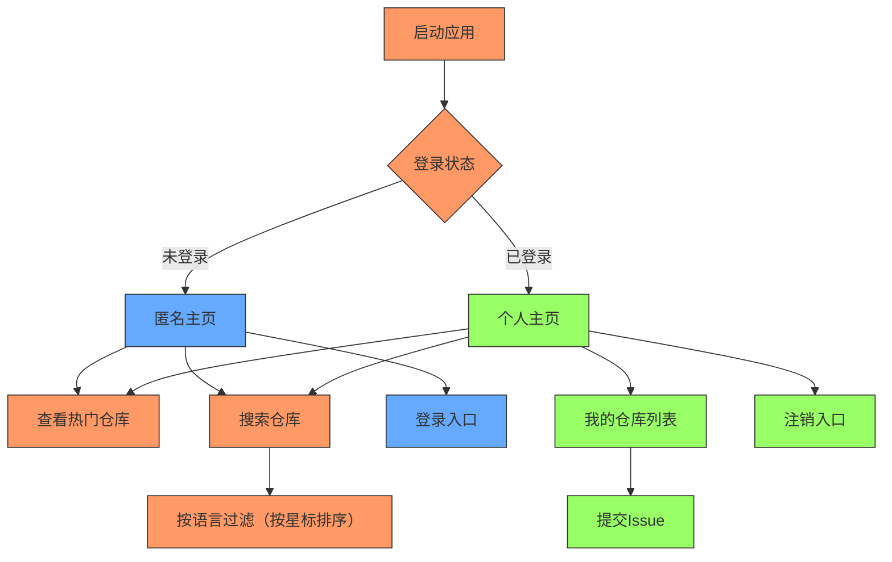
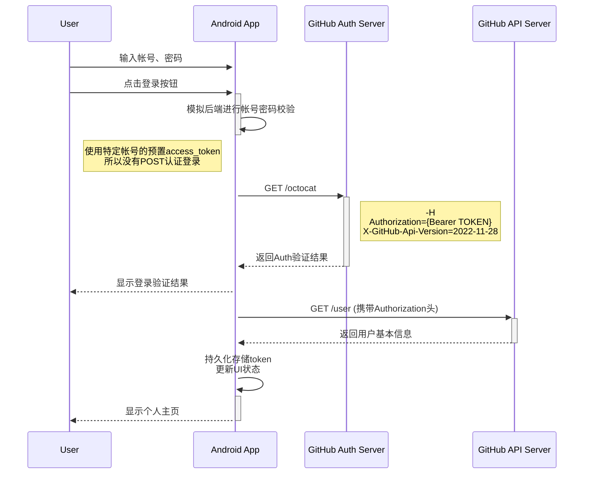
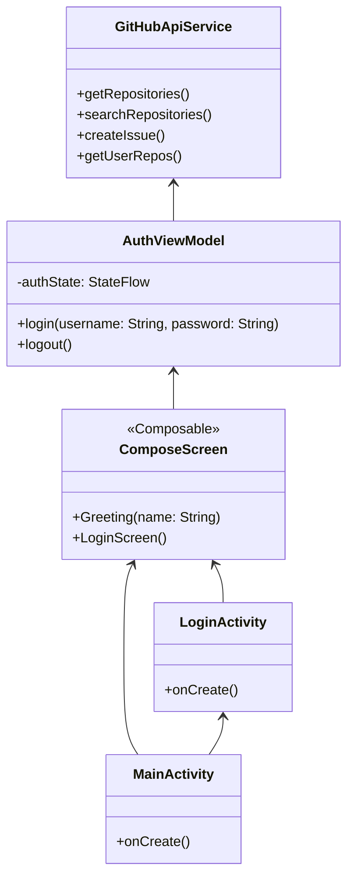

[TOC]

# UML图例说明

### 功能模块

```mermaid
graph TD
    A[启动应用] --> B{登录状态}
    B -- 已登录 --> C[个人主页]
    B -- 未登录 --> D[匿名主页]
    
    D --> E[查看热门仓库]
    D --> F[搜索仓库]
    D --> H[登录入口]
    
    C --> E[查看热门仓库]
    C --> F[搜索仓库]
    
    C --> I[我的仓库列表]
    I --> J[提交Issue]
    C --> K[注销入口]
    
    F --> L[按语言过滤（按星标排序）]

    
    classDef green fill:#9f6,stroke:#333;
    classDef orange fill:#f96,stroke:#333;
    classDef blue fill:#6af,stroke:#333;
    
    class C,I,J,K green
    class E,F,G,L,A,B orange
    class H,D blue
```

- 橙色模块：公共功能Flow
- 蓝色模块：匿名用户主页Flow
- 绿色模块：个人主页Flow

## 登录时序图

```mermaid
sequenceDiagram
    participant User
    participant App as Android App
    participant Auth as GitHub Auth Server
    participant API as GitHub API Server

    User->>+App: 输入帐号、密码
    User->>+App: 点击登录按钮
    App->>-App: 模拟后端进行帐号密码校验
    Note left of App: 使用特定帐号的预置access_token<br/>所以没有POST认证登录
    App->>+Auth: GET /octocat
    Note right of Auth: -H <br/>Authorization={Bearer TOKEN}<br/>X-GitHub-Api-Version=2022-11-28

    Auth-->>-App: 返回Auth验证结果
    App-->>User: 显示登录验证结果
    
    App->>+API: GET /user (携带Authorization头)
    API-->>-App: 返回用户基本信息

    App->>+App: 持久化存储token<br/>更新UI状态
    App-->>-User: 显示个人主页

```

## 应用架构的类图

```mermaid
classDiagram
    direction BT

    class MainActivity {
        +onCreate()
    }

    class LoginActivity {
        +onCreate()
    }

    class AuthViewModel {
        -authState: StateFlow<AuthState>
        +login(username: String, password: String)
        +logout()
    }

    class GitHubApiService {
        +getRepositories()
        +searchRepositories()
        +createIssue()
        +getUserRepos()
    }

    class ComposeScreen {
        <<Composable>>
        +Greeting(name: String)
        +LoginScreen()
    }

    MainActivity --> LoginActivity
    MainActivity --> ComposeScreen
    LoginActivity --> ComposeScreen
    ComposeScreen --> AuthViewModel
    AuthViewModel --> GitHubApiService
```

