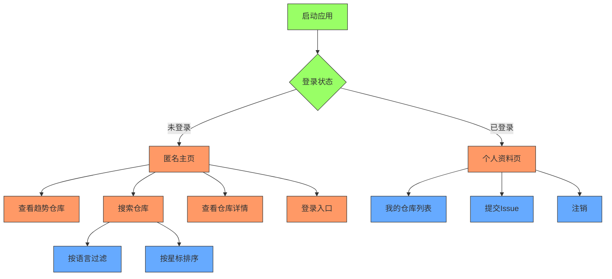
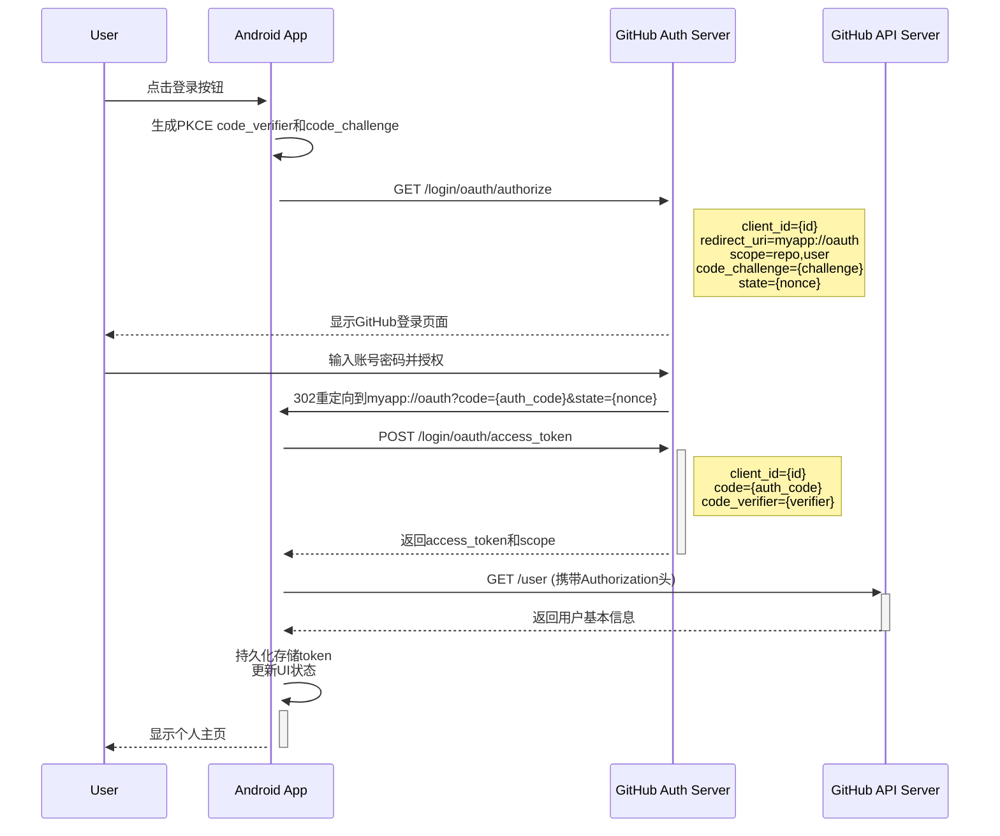
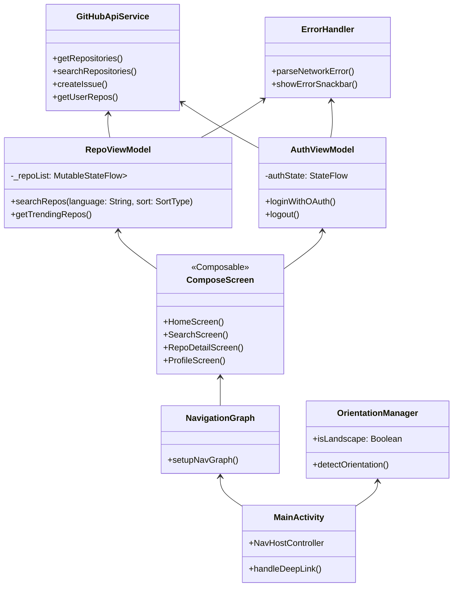

# UML图例

### 功能模块

```mermaid
graph TD
    A[启动应用] --> B{登录状态}
    B -- 已登录 --> C[个人资料页]
    B -- 未登录 --> D[匿名主页]
    
    D --> E[查看趋势仓库]
    D --> F[搜索仓库]
    D --> G[查看仓库详情]
    D --> H[登录入口]
    
    C --> I[我的仓库列表]
    C --> J[提交Issue]
    C --> K[注销]
    
    F --> L[按语言过滤]
    F --> M[按星标排序]
    
    classDef green fill:#9f6,stroke:#333;
    classDef orange fill:#f96,stroke:#333;
    classDef blue fill:#6af,stroke:#333;
    
    class A,B green
    class C,D,E,F,G,H orange
    class I,J,K,L,M blue
```

## 登录时序图

```mermaid
sequenceDiagram
    participant User
    participant App as Android App
    participant Auth as GitHub Auth Server
    participant API as GitHub API Server

    User->>+App: 点击登录按钮
    App->>+App: 生成PKCE code_verifier和code_challenge
    App->>+Auth: GET /login/oauth/authorize
    Note right of Auth: client_id={id}<br/>redirect_uri=myapp://oauth<br/>scope=repo,user<br/>code_challenge={challenge}<br/>state={nonce}

    Auth-->>User: 显示GitHub登录页面
    User->>+Auth: 输入账号密码并授权
    Auth->>+App: 302重定向到myapp://oauth?code={auth_code}&state={nonce}
    
    App->>+Auth: POST /login/oauth/access_token
    Note right of Auth: client_id={id}<br/>code={auth_code}<br/>code_verifier={verifier}

    Auth-->>-App: 返回access_token和scope
    App->>+API: GET /user (携带Authorization头)
    API-->>-App: 返回用户基本信息

    App->>+App: 持久化存储token<br/>更新UI状态
    App-->>-User: 显示个人主页

```

## 架构图

```mermaid
classDiagram
    direction BT

    class MainActivity {
        +NavHostController
        +handleDeepLink()
    }

    class AuthViewModel {
        -authState: StateFlow<AuthState>
        +loginWithOAuth()
        +logout()
    }

    class RepoViewModel {
        -_repoList: MutableStateFlow<List<Repo>>
        +searchRepos(language: String, sort: SortType)
        +getTrendingRepos()
    }

    class GitHubApiService {
        +getRepositories()
        +searchRepositories()
        +createIssue()
        +getUserRepos()
    }

    class ComposeScreen {
        <<Composable>>
        +HomeScreen()
        +SearchScreen()
        +RepoDetailScreen()
        +ProfileScreen()
    }

    class NavigationGraph {
        +setupNavGraph()
    }

    class ErrorHandler {
        +parseNetworkError()
        +showErrorSnackbar()
    }

    class OrientationManager {
        +isLandscape: Boolean
        +detectOrientation()
    }

    MainActivity --> NavigationGraph
    MainActivity --> OrientationManager
    ComposeScreen --> RepoViewModel
    ComposeScreen --> AuthViewModel
    RepoViewModel --> GitHubApiService
    AuthViewModel --> GitHubApiService
    RepoViewModel --> ErrorHandler
    AuthViewModel --> ErrorHandler
    NavigationGraph --> ComposeScreen

```

